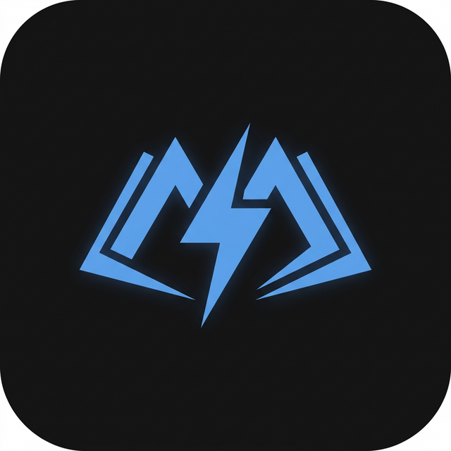

<div align="center">
  
  <h1>Manga Sonic</h1>
  <p><strong>A lightning-fast, minimalist, cross-platform manga reader for iOS, Android, and Windows.</strong></p>
</div>

---

## What is Manga Sonic?

Manga Sonic is designed with one primary goal: **uncompromising speed and simplicity.**
It ditches heavy abstraction layers, extension systems, and bloated UIs in favor of a sleek, dark-mode focused experience that gets you reading your favorite manga instantly.

### Why is it so fast?
- **Concurrent Networking:** Leverages tuned HTTP connection pooling (allowing up to 20 concurrent host connections) and parallel chunk downloading.
- **Offline-First Reading:** Once a chapter is downloaded, networking is completely bypassed. The reader strictly uses `Image.file()` ensuring zero lag or timeouts.
- **Aggressive Caching:** Uses precise LRU disk caches and heavily clamped memory boundaries to aggressively load look-ahead pages and instantly discard unseen ones.
- **Hardcoded Parsers:** Directly scrapes React Server Component (RSC) payloads and Next.js data to bypass DOM rendering overhead on supported sites.

---

## Features

⚡ **Sleek Minimalist UI**
A gorgeous, pure dark-mode interface designed to stay out of the way. No visual clutter, just your manga.

📚 **Offline Library & Categories**
Save favorites to categorized, offline-capable shelves powered by SQLite/Hive.

🚀 **Advanced Parallel Download Manager**
- Download up to **3 mangas concurrently**.
- Download up to **4 chapters per manga concurrently** (12 active parallel threads).
- Batch management: Multi-select entire manga groups or individual chapters to bulk-delete.

🔎 **Supported Sources**
- ManhuaTop
- AsuraComic (Fully RSC payload compliant)
- ManhuaPlus

---

## Screenshots

<div align="center">
  
  &nbsp;&nbsp;&nbsp;
  
  &nbsp;&nbsp;&nbsp;
  
</div>

---

## Getting Started

### Prerequisites
- Flutter SDK (latest stable)
- Supported targets: Android 8+, iOS 15+, Windows 10+

### Build & Run
```bash
flutter clean
flutter pub get
flutter run
```

### Release Builds
```bash
flutter build apk --release
flutter build windows --release
flutter build ipa --release
```

## Contribution
Contributions are welcome. Please ensure that PRs respect the core tenets of the app: minimal abstractions, maximum speed, and maintaining offline-first integrity for downloaded reading.
